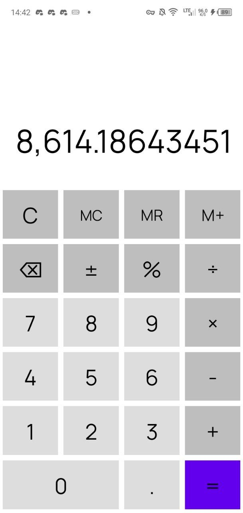
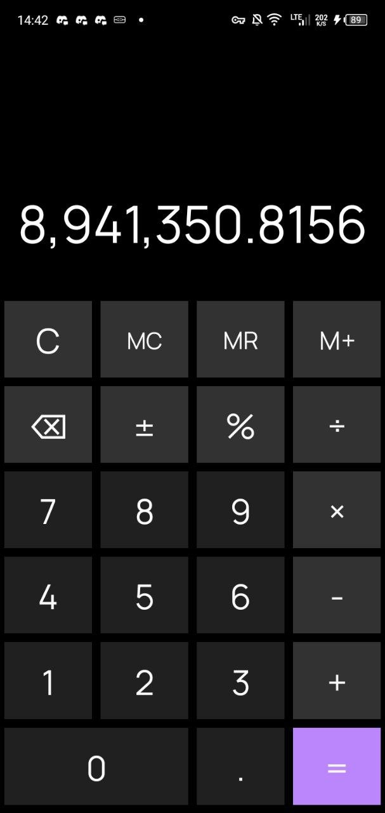

# WindowsPhone Calculator 📱

WindowsPhone Calculator is a simple yet functional calculator app for Android, designed with the aesthetics of Windows Phone in mind. 🌟

The app is lightweight and efficient, offering essential mathematical operations with a clean and user-friendly interface. Here’s what it includes so far:

### ✨ Features
🖌 **Windows Phone-inspired design** – A sleek, minimalistic interface reminiscent of the classic WP calculator.
🔢 **Basic arithmetic operations** – Perform addition, subtraction, multiplication, and division with ease.
🌀 **Smooth animations** – Designed to provide a seamless user experience.
🌗 **Light & dark themes** – Choose between two modes for better readability and battery savings.
💾 **Memory functions (MC, MR, M+)** – Store and recall numbers as needed.
🖩 **Percentage calculations (%)** – Quickly compute percentage values.
🔙 **Backspace function (⌫)** – Remove the last entered digit without resetting the entire input.
🔄 **Sign toggle (±)** – Instantly switch between positive and negative values.
🔢 **Formatted numbers** – Large numbers are displayed with proper formatting for better readability.

### 📸 Screenshots:

 

### 📥 Download & Installation
Since the app is still in development, some features may not be fully implemented yet.

1. **Download the APK** from the provided [link](https://github.com/pie-with-jam/WPCalculator/actions).
2. **Install the app** on your Android device.
3. **Launch the calculator** and start using it right away!

### 🌐 Community & Support
💬 Got suggestions or need help? Join the discussion!
[GitHub Issues](https://github.com/pie-with-jam/WPCalculator/issues) – Feedback & design consultation.

Stay tuned for updates! 🚀
